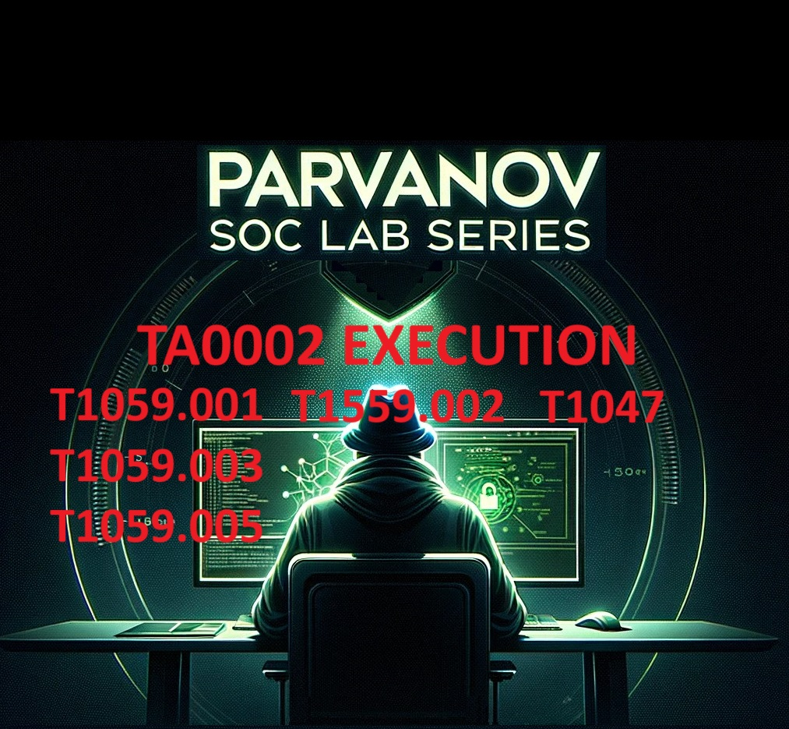
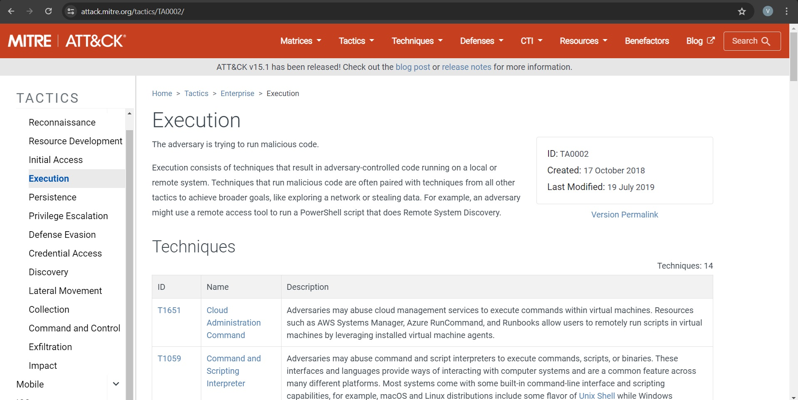

# Overview of the Execution Tactic

The Execution tactic (TA0002) in the MITRE ATT&CK framework involves techniques that adversaries use to run malicious code on a local or remote system. These techniques are essential for adversaries to gain control over a system and perform subsequent actions. For a comprehensive description, refer to the [MITRE ATT&CK Execution Tactic page](https://attack.mitre.org/tactics/TA0002/).

In this lab, we won’t cover all the techniques in the Execution Phase. However, understanding the concepts will enable you to explore them independently in your time.

## Overview of MITRE Cyber Analytics Repository (CAR)

The MITRE Cyber Analytics Repository (CAR) is an invaluable resource for detecting adversarial techniques. It provides analytics and detection strategies for various tactics and techniques. We will use the suggestions for detection with Splunk, leveraging analytics from MITRE and CAR. For detailed information, visit the [MITRE CAR page](https://car.mitre.org/).

Now, it is time for our first technique from TA0002.
