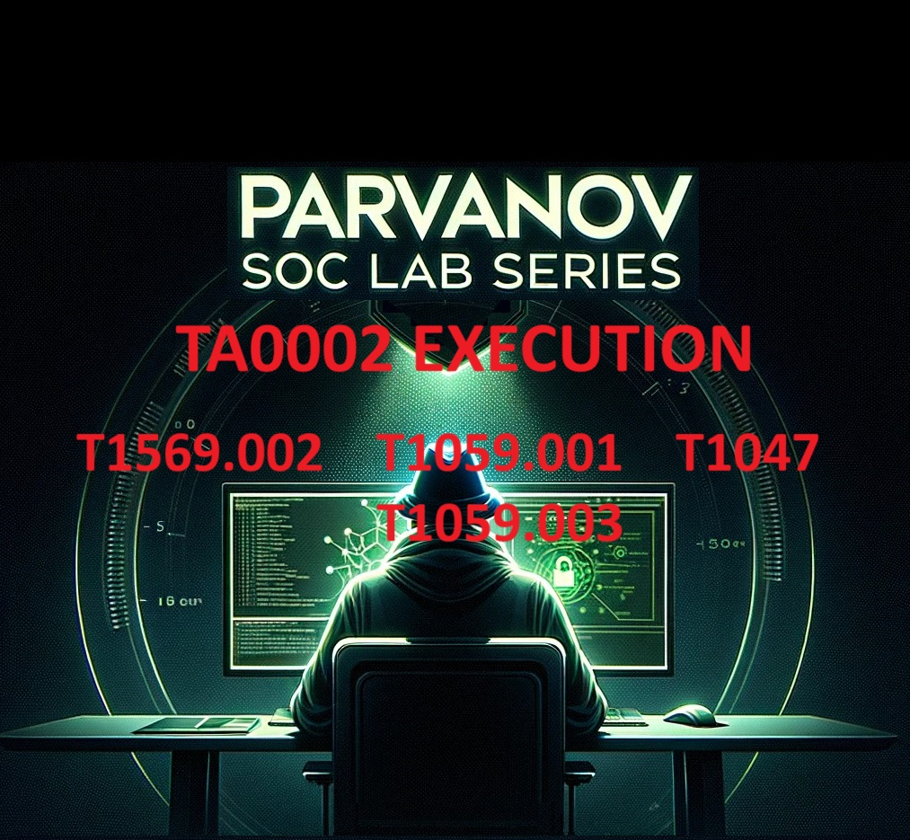

# Overview of the Execution Tactic

The Execution tactic (TA0002) in the MITRE ATT&CK framework involves techniques that adversaries use to run malicious code on a local or remote system. These techniques are essential for adversaries to gain control over a system and perform subsequent actions. For a comprehensive description, refer to the [MITRE ATT&CK Execution Tactic page](https://attack.mitre.org/tactics/TA0002/).

In this lab, we won’t cover all the techniques in the Execution Phase. However, understanding the concepts will enable you to explore them independently in your time.

## Overview of MITRE Cyber Analytics Repository (CAR)

The MITRE Cyber Analytics Repository (CAR) is an invaluable resource for detecting adversarial techniques. It provides analytics and detection strategies for various tactics and techniques. We will use the suggestions for detection with Splunk, leveraging analytics from MITRE and CAR. For detailed information, visit the [MITRE CAR page](https://car.mitre.org/).

Now, it is time for our first technique from TA0002.
### T1059: Command and Scripting Interpreter
Adversaries may abuse command and script interpreters to execute commands, scripts, or binaries. For more details, visit the MITRE ATT&CK page for T1059.

https://attack.mitre.org/techniques/T1059/
T1059 consists of 10 sub-techniques, each representing different methods of abusing command and script interpreters:

## T1059.001 — PowerShell: PowerShell is often used by adversaries due to its powerful capabilities and deep integration into the Windows operating system.
## T1059.002 — AppleScript: Adversaries may use AppleScript to execute commands and scripts on macOS systems.
## T1059.003 — Windows Command Shell: The Windows Command Shell can be used to execute a wide range of commands and scripts.
## T1059.004 — Bash: Bash, commonly used on Unix-like systems, can be abused to run commands and scripts.
## T1059.005 — Script Execution: Generic script execution, applicable to various scripting languages.
## T1059.006 — Python: Python scripts can be used to execute a wide range of commands and scripts.
## T1059.007 — JavaScript: JavaScript can be executed in various environments, including web browsers and Node.js.
## T1059.008 — Tcl: Tcl scripts can be used to execute commands and perform automation.
## T1059.009 — Visual Basic: Visual Basic scripts can be used to execute commands and automate tasks in Windows environments.
## T1059.010 — XSLT: XSLT can be used to transform XML data and can include executable code.
Each of these sub-techniques represents a unique vector that adversaries can exploit. It is crucial to understand and simulate these techniques to enhance detection capabilities.

We will only go through a few of them in this series to demonstrate practical emulation and detection. Let’s start with T1059.001.
