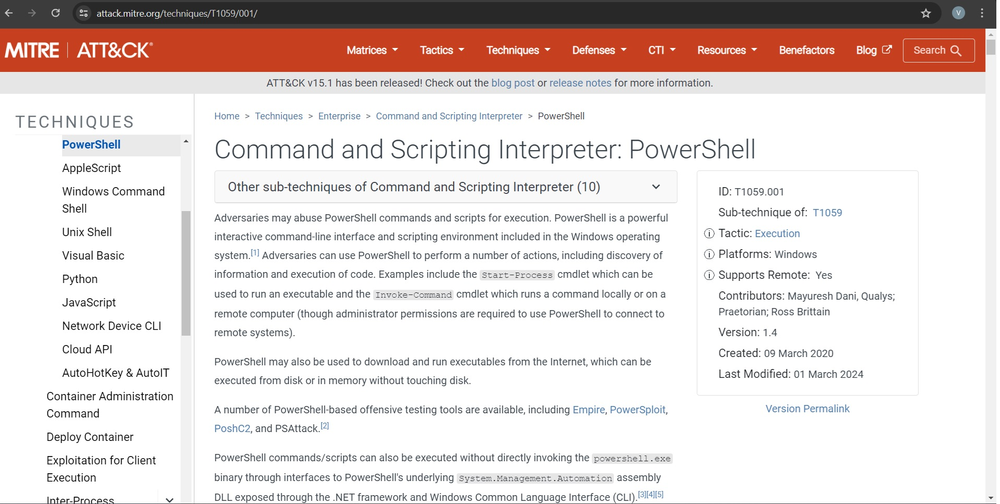

# T1059.001 — PowerShell
Adversaries may use PowerShell commands and scripts to execute malicious activities. PowerShell, an interactive command-line interface and scripting environment in Windows, can be used for various purposes such as discovering information and executing code. For more details, visit the MITRE ATT&CK page for T1059.001.

##HOW TO DETECT T1059.001 — PowerShell

MITRE provides detection analytics for identifying malicious PowerShell activities. You can find these analytics and recommendations on the MITRE ATT&CK page for T1059.001.
![Poster])

Now, let’s put theory into practice by engaging TA0002 with some practical emulation using Atomic Red Team.
## T1059.001 Atomic Test 1 — Mimikatz
![Poster]

Running the command Invoke-AtomicTest T1059.001 1 on your Windows machine will start the test which will simulate Downloading Mimikatz and dumping credentials.
![Poster] 

For this Atomic test, we can use the analytic provided from CAR-2014–04–003: Powershell Execution. We can use a Splunk query to detect process creation.
![Poster]

![Poster]
Now let’s check if we can go through logs and detect what happened. Go to your Splunk instance and use the search query provided. As you can see below, we have a few results back. Digging a bit deeper, we can see that the detection was successful.
![Poster]
You can continue to follow the thread of this event by investigating Windows event logs as well. In a real production environment, there will be noise and additional factors to consider. You can also involve your firewall, check its logs for new connections, create blocklists, and create IDPS rules for such threats. Additionally, you can create alerts based on that query in Splunk.
