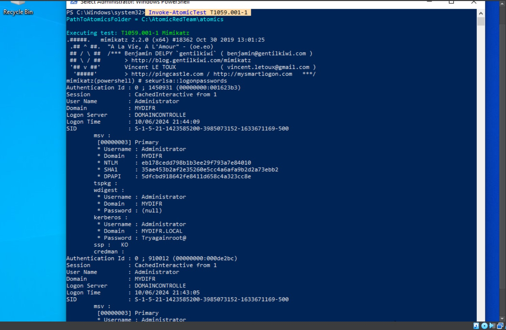

# T1059.001 — PowerShell
Adversaries may use PowerShell commands and scripts to execute malicious activities. PowerShell, an interactive command-line interface and scripting environment in Windows, can be used for various purposes such as discovering information and executing code. For more details, visit the MITRE ATT&CK page for T1059.001.

##HOW TO DETECT T1059.001 — PowerShell

MITRE provides detection analytics for identifying malicious PowerShell activities. You can find these analytics and recommendations on the MITRE ATT&CK page for T1059.001.

Now, let’s put theory into practice by engaging TA0002 with some practical emulation using Atomic Red Team.
## T1059.001 Atomic Test 1 — Mimikatz

Running the command Invoke-AtomicTest T1059.001 1 on your Windows machine will start the test which will simulate Downloading Mimikatz and dumping credentials.
 
